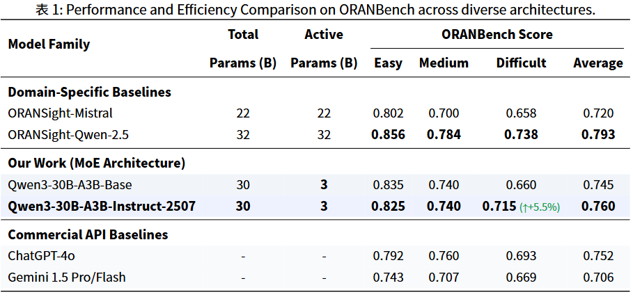

# ORAN-SFT-MoE

## 重要文件介绍

- ranstruct文件夹中的代码为ORAN大模型结构化数据集生成工具，主要功能是从O-RAN规范文档和代码集中自动生成结构化的问答数据集，供大模型进行监督微调（SFT）。
- output/dataset下的ranstruct_dataset_cleaned_*.jsonl文件为最终生成的结构化数据集，已经经过清洗和格式化处理，适合直接用于模型训练。oran_train.jsonl和oran_val.jsonl分别为训练集和验证集。oran_val_13K.jsonl(oran_val_600.jsonl是抽取的其中一部分)是其他开源仓库的验证集，用来做对比测试。

## RANSTRUCT

[RANSTRUCT数据集生成流程解释](RANSTRUCT.md)

[RANSTRUCT代码结构说明](ranstruct/README.md)

[最终用自制数据集得到的基于Qwen3-30B-A3B-Instruct-2507微调的模型](https://huggingface.co/silence-breaker-wj/oran-30b/tree/main)

## 微调成果
以Qwen3-30B-A3B-Instruct-2507为基础模型，使用oran_train.jsonl进行监督微调，得到的模型在oran_val_13K.jsonl上的表现如下：

实测模型表现：逻辑能力无损，在保持 O-RAN 领域专业性的同时，依然保留了通用的逻辑推理与对话能力

